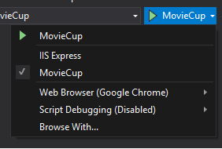

# MovieCup

## Repositories
    * Front: https://github.com/hunterdi/MovieCupFront
    * Back: https://github.com/hunterdi/MovieCup
    
## Requirements
* Dotnet Core >= 2.2
* Node >= 10.15
* Visual Studio 2017 or VS Code >= 1.36.1

## Starting Project
* In the project folder contains two folders(MovieCup and MovieCupFront).
* To go up the Back Project (MovieCup), case use Visual Studio 2017, open the project solution is that in folder.
    * Start project with the follow image:

        
    
* Case, be your preference utilize in your terminal the following command in folder that contain the file MovieCup.csproj:
    * dotnet run --project ./MovieCup.csproj
        * OBS.: The project is configured to use "http://localhost:5000"
        * This address is configured to show the index.html of the swagger

* To go up the Front Project (MovieCupFront), execute the following command in your terminal command:
    * 1º npm i.
    * 2º npm start.
        * OBS.: The project is configured to use "http://loacalhost:42000".